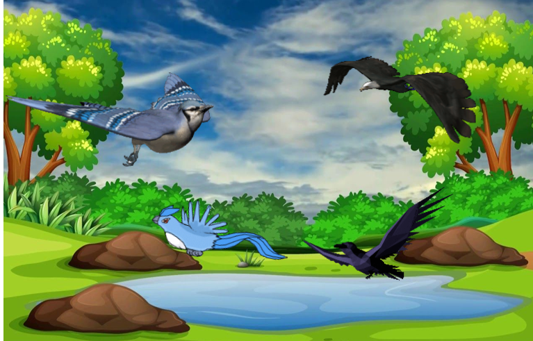
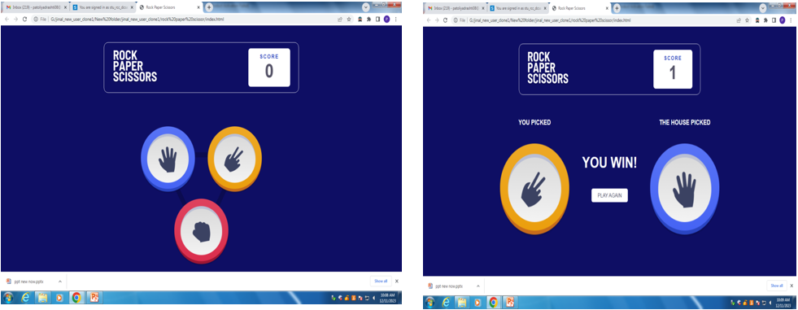
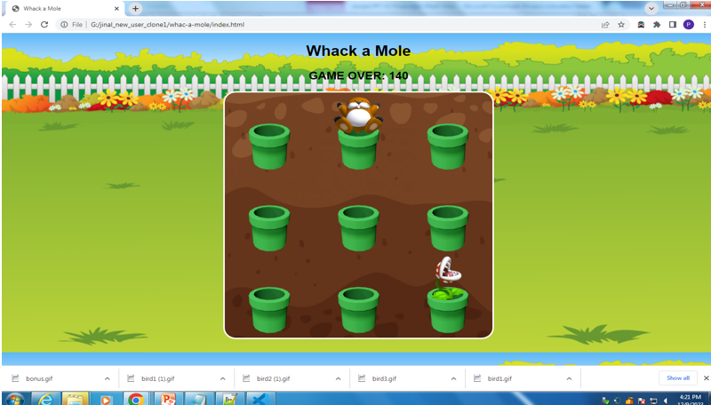

# 🎮 Game-O-Mania

**Game-O-Mania** is a web-based mini game arcade built using HTML, CSS, and JavaScript. It features a collection of simple yet fun games that test your reflexes, logic, and attention.

> 🔗 **[Play Live Now](https://jinal-vachheta-58.github.io/project-1-game-o-mania/HOMEPAGE/homepage_index.html)**

---

## 🕹️ Games Included

### 1. 🐦 Hunting Bird
A shooting game where players aim to shoot birds appearing on the screen.

- 🏹 Shoot ordinary birds: **+1 point**
- 🦜 Shoot bonus birds: **+5 points**
- ❌ Miss a shot: **-1 point**
- 🕒 Game duration: **50 seconds**
- 🔄 Unlimited bullets

#### 🎯 How to Play
- Use your **mouse** to aim.
- **Left-click** to shoot.
- Hit as many birds as you can within the time limit.
- Keep track of your score via the counter.

### 🐦 Hunting Bird

---

### 2. ✊✋✌️ Rock, Paper, Scissors

Play against the computer in this digital version of the classic hand game.

- 🪨 Rock crushes Scissors  
- ✂️ Scissors cuts Paper  
- 📄 Paper covers Rock

#### 🎮 How to Play
- Click on **Rock**, **Paper**, or **Scissors**.
- The computer makes a random choice.
- The game decides the winner using the standard rules.

### ✊✋✌️ Stone Paper Scissors

---

### 3. 🕳️ Whack-a-Mole

A fun reflex-based game where moles pop out of holes randomly.

- 🐹 Whack a mole: **+10 points**
- 🌱 Click a plant: **Game Over**

#### 🎮 How to Play
- Use your **mouse** to click on moles.
- Avoid clicking on the plants.
- Score as high as you can!

### 🕳️ Whack-a-Mole

  ---

## 🛠️ Tools & Technologies Used

- **HTML5** – Structuring content and UI elements
- **CSS3** – Styling, animation, and responsive layout
- **JavaScript** – Game logic and user interaction
- **VS Code** – Code editing
- **Git & GitHub** – Version control and hosting
- **Google Chrome** – Testing and debugging

---

## 🎯 Objective

To demonstrate how front-end web technologies—HTML, CSS, and JavaScript—can be effectively integrated to build engaging, interactive browser games focused on responsiveness and user experience.

- **Hunting Bird:** Boosts aim and timing  
- **Stone Paper Scissors:** Tests decision-making under uncertainty  
- **Whack-a-Mole:** Enhances hand-eye coordination and reflexes

---

## 🧠 Conclusion

Through this project, we gained practical experience in:

- Front-end development with **HTML, CSS, and JavaScript**
- Game logic, DOM manipulation, and animations
- Critical thinking, creative design, and interactive UI building
- Project planning, teamwork, and problem-solving

---

## 🔗 Live Site

👉 [Click here to play Game-O-Mania](https://jinal-vachheta-58.github.io/project-1-game-o-mania/HOMEPAGE/homepage_index.html)

---

